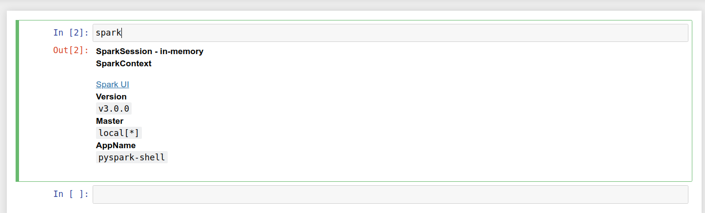

# Google Summer of Code 2020 Final Report
## SparkManager --- A Jupyter Notebook Extension

## Introduction 

Apache Spark which is used by people at Astronomy Commons enables large scale distributed computing via creating local and remote clusters. 
But the problem is that for creating and configuring a cluster one needs to write multiple lines of cumbersome codes. Additionally, if we are scheduling a job on Kubernetes, then we need to write more options and configs.  In the long run , maintaining the clusters programmatically becomes inefficient, complicated  and unmaintainable. 
For example: To customize a cluster’s executors and driver we need to write something like:

<pre>
import pyspark
# Spark Session
spark = (
    pyspark
    .sql
    .SparkSession
    .builder
    .config('spark.driver.memory', '12g')
    .config("spark.driver.cores", "4")
    .config("spark.executor.instances", "24")
    .config("spark.executor.cores", "4")
    .config("spark.executor.memory", "57500m")
    .getOrCreate()
)
# Spark Context
sc = spark.sparkContext
</pre>

The extension provides a well-designed interface within Jupyter Notebook that could replace the programmatic creation of (or connection to) a Spark cluster with simple UI elements. 

<kbd>

</kbd>
 

This extension will thus enable all of the astronomy community to easily manage their Apache Spark clusters via an easy to use Jupyter Notebook extension called “SparkManager”

## Features 

### 1. Create a spark cluster by the click of a few buttons

<kbd>

</kbd>
 
With the extension one can create pyspark clusters locally or on kubernetes based on the config files that are selected. 
The drop down allows the user to select the config file he wants to load and based on that config file the cluster is created. 

### 2. Configure or update a cluster. 

<kbd>

</kbd>
 

Once the cluster is created with the existing configurations users can also update the memory/core and other configurations! 

### 3. "spark" variable is injected into the jupyter notebook 

<kbd>

</kbd>
 

The "spark" variable is injected into the kernel and now can be accessed and used.

### 4. The spark UI link is generated.

Once the user clicks on the "UI" button the user is taken to the spark web UI interface

## How it works

Please visit: <a href="https://github.com/astronomy-commons/sparkmanager/blob/master/docs/how_it_works.md"> How It Works </a>

## Installation

Please visit <a href="https://github.com/astronomy-commons/sparkmanager/blob/master/docs/installation.md">Installation</a>

## Future work

1. Make the extension for Jupyter Lab
2. Integrate real time logs from the Kernel
3. Add tooltips for buttons
